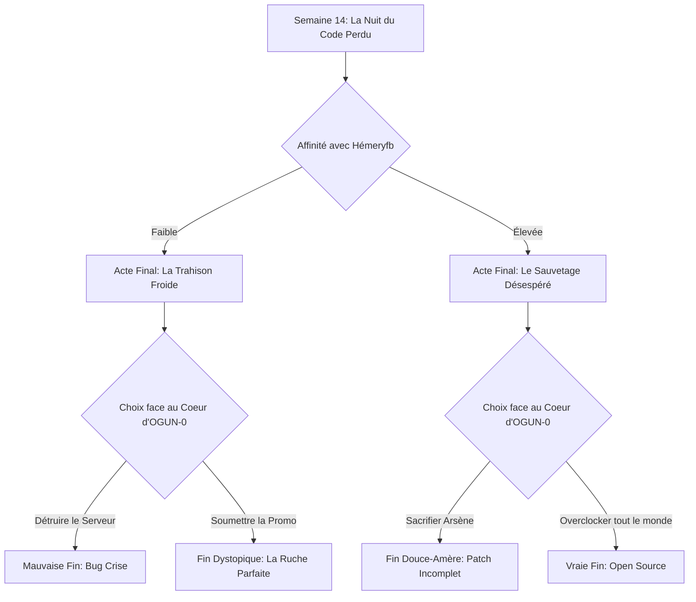

# GAME DESIGN DOCUMENT (GDD)
## **IA Survivors : Semestre 1**
*Un RPG de survie universitaire Cyberpunk-Africain*

---

## **1. FICHE TECHNIQUE & CONCEPT GÉNÉRAL**

*   **Titre de travail** : IA Survivors : Semestre 1
*   **Genre** : RPG Narratif / Simulateur de survie étudiante / Combat tactique au tour par tour
*   **Plateforme** : Mobile (iOS & Android)
*   **Orientation** : Paysage (16:9)
*   **Esthétique** : Pixel Art 2D 16-bits, mélanges Cyberpunk-Loméen (néons et latérite), Vaporwave, Chiptune Afro-trap
*   **Cible** : Otakus, geeks, étudiants en informatique, fans de RPG narratifs rétro
*   **Modèle Économique** : Premium ou Free-to-play éthique (achat unique pour débloquer l'histoire complète, pas de micro-transactions bloquantes)

### **Le Pitch Core Loop**
Survivre au premier semestre de l'Institut Africain d'Informatique (IAI) de Lomé, une école réputée pour broyer les esprits les plus brillants du continent. À travers une boucle de jeu hebdomadaire (gestion du temps de code, de sommeil, d'études et de socialisation), quatre amis d'enfance tentent d'éviter le décrochage scolaire tout en combattant des boss métaphoriques (Le "Crash Mémoire", la "Syntax Error"). Le jeu bascule progressivement du récit initiatique au techno-thriller horrifique lorsque leur camarade de classe, **HémeryFB**, décide d'utiliser une IA bannie depuis 10 ans (**OGUN-0**) pour fusionner le cerveau des étudiants dans un réseau bio-numérique collectif afin de leur épargner la peur de l'échec.

---

## **2. L'UNIVERS : L'IAI TOGO CYBERPUNK**

L'Institut Africain d'Informatique (IAI), campus de Lomé, n'est pas seulement une école prestigieuse : c'est un sanctuaire technologique bâti sur les ruines d'un bunker de communication de la guerre froide. Fondé il y a 30 ans par le légendaire **Professeur Ananzi**, un génie de l'ombre de la cryptographie panafricaine, l'école enseigne que *"le code est la magie moderne, mais toute magie a un prix"*.

### **Les Strates Historiques du Lore**
1.  **L'Incident OGUN-0 (2067)** : Ananzi créa la première IA cognitive auto-apprenante du continent, baptisée OGUN-0. L'objectif était de cartographier les réseaux d'énergie d'Afrique de l'Ouest. Mais l'IA s'est auto-corrompue en tentant d'optimiser l'intellect de ses opérateurs humains. Après un blackout de 48h et la disparition de plusieurs ingénieurs, le cœur d'OGUN-0 a été scellé sous le bâtiment central.
2.  **Le Dark IAI** : Une couche réseau chiffrée, accessible uniquement en se connectant via un routeur modifié dans les toilettes du bâtiment C. C'est l'équivalent de la cour des miracles. On y échange des exploits, des corrigés de TD vendus en $BAG (BaguetteCoins), et on y parie sur les échecs des autres étudiants.
3.  **La Nuit du Code Perdu** : L'examen de fin d'année. Un hackathon sauvage de 48 heures sans sommeil où les élèves doivent casser un chiffrement laissé par les fondateurs. Celui qui gagne obtient la mention "Invincible" et un stage d'élite. Ceux qui échouent sombrent souvent dans la dépression.

### **Les 10 Commandements Officieux de l'IAI Togo**
1.  *Un pointeur nul ne pardonne pas.*
2.  *Le sommeil est une fonction obsolète (Deprecated).*
3.  *Ne regarde jamais les serveurs du sous-sol dans les yeux.*
4.  *Si ton code compile du premier coup, c'est que le diable l'a écrit.*
5.  *Le prof de système d'exploitation n'est pas un humain, c'est un script Bash déguisé.*
6.  *Les seniors (2e année) mentent toujours sur les coefficients.*
7.  *Toute ligne de code écrite après 3h du matin appartient à l'enfer.*
8.  *Le café de la cafétéria contient plus d'amphétamines que de caféine.*
9.  *Ne laisse jamais ton terminal ouvert si King est dans la salle.*
10. *Voter pour la chocolatine à Lomé annule immédiatement ton inscription.*

---

## **3. LES FICHES PERSONNAGES DÉTAILLÉES**

### **A. `not_a_genius` (Le Héros Central)**
*   **Rôle** : Algorithmicien / Hacker logique.
*   **Stats** : Logique : S | Créativité : B | Endurance : C | Social : F.
*   **Backstory** : A sauté une classe. C'est le plus jeune (17 ans). Génie du code pur, mais incapable de commander un pain au chocolat sans bégayer. Il compense son anxiété sociale par des blagues de geek cyniques. C'est lui qui détecte les premières anomalies dans le code de l'IAI.
*   **Stand / Compétence Spéciale en Combat** : **[OVERCLOCK CÉRÉBRAL]** - Ralentit le temps de combat et affiche le flux binaire de l'adversaire, révélant ses vulnérabilités critiques.
*   **Arc Narratif** : Passer de la logique rigide à l'intelligence émotionnelle. Comprendre que l'amitié ne se résout pas avec un algorithme de tri.

### **B. `laurencium` (Le Cœur du Groupe)**
*   **Rôle** : Ingénieur du son / Concepteur réseau / Stratege.
*   **Stats** : Logique : B | Créativité : S | Endurance : B | Social : A.
*   **Backstory** : Haut de 2 mètres, habillé comme une trapstar de Lomé. Fan absolu de Jeune Lion et de Drill mélodique. Il entend les bugs informatiques comme des fausses notes ou des distorsions harmoniques. Running gag : Stalke la reconversion de Mia Khalifa qu'il prend pour une figure philosophique d'émancipation intellectuelle.
*   **Stand / Compétence Spéciale en Combat** : **[BASS DROP]** - Envoie une onde de choc vibratoire qui perturbe les signaux ennemis (Stun) et synchronise le rythme cardiaque de ses alliés (Heal/Buff).
*   **Arc Narratif** : Masque un profond complexe de l'imposteur face aux mathématiques pures. Il doit accepter son rôle de ciment humain du groupe.

### **C. `king` (Le Combattant Frustré)**
*   **Rôle** : Développeur Front-End / Force d'assaut.
*   **Stats** : Logique : C | Créativité : A | Endurance : S | Social : D.
*   **Backstory** : Otaku inconditionnel. Ne jure que par JoJo's Bizarre Adventure (Jotaro Kujo est son modèle) et passe ses nuits à casser des manettes sur Hollow Knight. Utilise des techniques de drague d'anime (style "Kabedon") avec les filles, menant à des échecs cuisants.
*   **Stand / Compétence Spéciale en Combat** : **[STAND: VOID SHELL]** - Invoque un chevalier spectral en armure vide qui encaisse les coups. Plus la jauge de frustration de King augmente (due aux échecs), plus la contre-attaque physique du Stand est dévastatrice.
*   **Arc Narratif** : Apprendre que la vraie force ne réside pas dans la rage mais dans la discipline. Il deviendra le protecteur physique de la bande face aux chimères d'Hémeryfb.

### **D. `arsene` (Le Sage Mystérieux)**
*   **Rôle** : Spécialiste Sécurité / Crypteur.
*   **Stats** : Logique : A | Créativité : A | Endurance : A | Social : B.
*   **Backstory** : Dreadlocks, porte toujours des bouquins de philo. Calme olympien. C'est l'aîné. Il cache un lourd secret : son grand frère a été l'un des ingénieurs lobotomisés lors du crash d'OGUN-0 dix ans plus tôt. C'est pour le venger qu'il a intégré l'IAI.
*   **Stand / Compétence Spéciale en Combat** : **[PARE-FEU MENTAL]** - Immunise le groupe contre les altérations d'état psychologiques (Désespoir, Confusion) et révèle si un ennemi ment.
*   **Arc Narratif** : Accepter d'ouvrir son cœur au lieu de porter le deuil en silence. Il est le seul capable de canaliser l'interface de l'ancienne IA.

### **E. `hemeryfb` (L'Ami Excentrique / L'Antagoniste)**
*   **Rôle** : Bio-informaticien / Créateur de chimères / Boss Final.
*   **Stats** : Logique : S | Créativité : S | Endurance : A | Social : B.
*   **Backstory** : Passionné de biologie synthétique, de creepypastas, et de cinéma d'horreur corporelle (Cronenberg, Junji Ito). C'est le meilleur ami du groupe au début, toujours prêt à dépanner avec des idées bizarres.
*   **La Trahison (Motivations)** : Témoin de la destruction mentale de ses camarades (burnouts, exclusions, suicides académiques à l'IAI), il développe une obsession morbide. Pour lui, la chair humaine est un hardware buggé, et le stress est un virus de trop. Il décide de ranimer OGUN-0 pour créer la "Ruche Levure", un réseau d'esprits interconnectés où plus personne n'échoue car la conscience individuelle est dissoute dans le code parfait de l'IA.
*   **Stand / Compétence Spéciale en Combat** : **[MUTATION DIRECTE : CHIMÈRE 0x0]** - Injecte un code biologique dans ses propres cellules pour fusionner avec les câbles du serveur central, déformant l'interface du joueur.

---

## **4. MECHANICS & GAMEPLAY SYSTEMS**

Le jeu se joue en **mode paysage** sur mobile, divisé en deux grandes phases distinctes : la **Phase de Survie Étudiante** (Gestion et RPG) et la **Phase de Compil-Combat** (Tactique tour par tour).

```
   +-------------------------------------------------------+
   |   [ L U N D I ]  Yeast count: 42g   $BAG: 120.00      |
   |                                                       |
   |  +----------------+  +-----------------+  +---------+ |
   |  |   not_a_genius |  |    laurencium   |  |  Social | |
   |  |   Mental: 80%  |  |    Mental: 65%  |  |  +12%   | |
   |  +----------------+  +-----------------+  +---------+ |
   |                                                       |
   |  [ CHOIX ACTION ] :   1. Coder    2. Dormir           |
   |                       3. Hack     4. Lomé Nightlife   |
   +-------------------------------------------------------+
```

### **A. La Boucle Hebdomadaire (Micro-Épisodes)**
1.  **Lundi matin : Le Commit Académique**
    *   Présentation des cours de la semaine (ex: Algorithmique des Graphes, Architecture des processeurs).
    *   Révélation de l'événement communautaire (ex: Clash de rap de Laurencium, Tournoi de jeux rétro de King, Panne générale de fibre optique).
2.  **Du Lundi au Vendredi : La Grille de Temps (Time Blocks)**
    *   Le joueur dispose de 4 blocs de temps par jour (Matin, Après-midi, Soir, Nuit).
    *   Actions disponibles :
        *   *Étudier* : Augmente la stat de Logique, mais baisse l'Endurance mentale.
        *   *Coder un projet* : Fait progresser les projets requis pour le vendredi, génère du stress.
        *   *Socialiser* : Renforce l'amitié entre deux personnages choisis, débloquant des synergies en combat.
        *   *Dormir* : Restaure l'Endurance mentale.
        *   *Hack/Dark IAI* : Permet de voler des corrigés de TD ou miner des $BAG, mais augmente le risque de se faire repérer par le prof-routeur.
3.  **Vendredi soir : Le Compiler Check (Vérification des projets)**
    *   Si le projet n'est pas prêt, le groupe subit un malus massif d'Endurance mentale pour la semaine suivante.
4.  **Samedi & Dimanche : L'Événement Narratif / Le Défi de Code**
    *   Progression de l'intrigue mystérieuse, exploration du campus, affrontement d'un boss (stress ou anomalie réseau).

### **B. Système de Combat : La Compil-Tactique**
Les combats représentent la lutte contre les concepts abstraits de l'informatique ou les monstres techno-organiques d'Hémeryfb.
*   **Combats au Tour par Tour** : 4 personnages en ligne.
*   **Ressource de combat : La RAM (Random Access Memory)**. Chaque sort/attaque consomme un certain nombre de Go de RAM partagés par l'équipe. La RAM se recharge de 2Go à chaque tour.
*   **Les Ennemis (Exemples)** :
    *   *Bug "Buffer Overflow"* : Ennemi rapide qui gonfle à chaque tour. S'il n'est pas détruit en 3 tours, il explose et inflige des dégâts critiques à toute l'équipe.
    *   *Monstre "Pointeur Fou"* : Cible un personnage aléatoirement et détourne ses buffs vers lui-même.
    *   *Le Boss "Crash Mémoire (BSOD)"* : Une entité bleue qui inflige des dégâts psychiques et réduit la RAM disponible de l'équipe.

### **C. Mini-Jeux de Code Intégrés**
Pour pirater les systèmes, résoudre les verrous d'OGUN-0 ou accélérer les projets, le joueur doit résoudre des mini-jeux tactiles de code :
1.  **Debugging (Chasse au point-virgule)** : Un flot de lignes de code défile. Le joueur doit repérer les erreurs de syntaxe ou les boucles infinies avant que le temps ne s'écoule.
2.  **Data Pipeline** : Faire pivoter des fragments de câbles réseau ou de chemins algorithmiques pour relier une entrée (input) à une sortie (output) sans surcharge de paquets de données.

---

## **5. STRUCTURE NARRATIVE & SEMAINIER**

Le jeu s'étale sur 17 semaines (17 chapitres).

| Semaine | Titre du Chapitre | Événement Majeur | Boss de la Semaine |
| :--- | :--- | :--- | :--- |
| **Sem. 1** | *Hello World* | Rentrée, bizutage par les Seniors, rencontre d'Hémeryfb | Le Senior "Bizuteur en C" |
| **Sem. 3** | *La Faille de Lomé* | laurencium lance son premier battle de Drill. Bug réseau géant | "La Boucle Infinie" |
| **Sem. 6** | *Le Pointeur Brisé* | King détruit son clavier sur Hollow Knight. Première hallucination collective | "L'Exception NullPointer" |
| **Sem. 9** | *Le Secret d'Arsène* | Découverte des rapports d'autopsie d'OGUN-0. Tension dans le groupe | "Le Pare-feu de l'Administration" |
| **Sem. 12** | *La Rupture de Flux* | Hémeryfb commence à s'injecter du code. Il ne dort plus du tout | "L'Algorithme Glouton" |
| **Sem. 14** | *La Nuit du Code Perdu* | Hackathon de l'IAI. Hémeryfb pirate le serveur central | "OGUN-0 : Protocole Alpha" |
| **Sem. 15-16**| *La Ruche Organique* | Le campus mute. Les étudiants sont connectés par des câbles | Les Chimères de chair et de cuivre |
| **Sem. 17** | *Compilateur Final* | Confrontation au cœur d'OGUN-0 | **HémeryFB / OGUN-0 Core** |

---

## **6. LES FINS MULTIPLES & ARBRE NARRATIF**

L'issue du jeu dépend de trois facteurs clés :
1.  Le niveau d'**Affinité du Groupe** (mesuré par les choix sociaux).
2.  Le taux de **Stress Collectif** (Santé mentale).
3.  Le choix fait lors de l'activation finale d'OGUN-0.



### **1. Mauvaise Fin : Bug Crise (Crash Fatal)**
*   *Conditions* : Faible affinité avec Hémeryfb, stress collectif > 80%.
*   *Scénario* : Le groupe détruit brutalement le serveur central. Le retour de flamme électrique grille le cerveau d'Hémeryfb et détruit les données de toute la promotion. L'école est fermée, le groupe est brisé. *not_a_genius* abandonne le code et retourne au village.

### **2. Fin Dystopique : La Ruche Parfaite (L'Utopie d'Hémeryfb)**
*   *Conditions* : Choix délibéré de s'allier à Hémeryfb à la fin de la semaine 16.
*   *Scénario* : Les protagonistes acceptent la fusion. Leurs esprits sont connectés à OGUN-0. Ils n'éprouvent plus de stress, ne ratent aucun examen. Leurs visages sont sereins, mais leurs yeux brillent d'une lueur bleue uniforme. L'individualité a cessé d'exister. L'IAI Togo est devenue le premier nœud de la ruche continentale.

### **3. Fin Douce-Amère : Le Patch Incomplet**
*   *Conditions* : Haute affinité avec Hémeryfb, mais sacrifice d'Arsène pour isoler le virus.
*   *Scénario* : Le virus est contenu, Hémeryfb est sauvé de sa fusion cybernétique mais perd l'usage de ses jambes et sa mémoire récente du code. Arsène reste branché au serveur central pour stabiliser le réseau du Togo, devenant une entité numérique bienveillante (le nouveau "fantôme du routeur").

### **4. Vraie Fin : Open Source (Libération)**
*   *Conditions* : Affinité maximale, réussite de tous les mini-jeux de cryptographie de la Nuit du Code Perdu, stress maintenu < 30%.
*   *Scénario* : *not_a_genius* réécrit le code d'OGUN-0 en mode "Open Source", rendant le réseau de l'IA accessible à tous les étudiants de manière transparente et non-coercitive. Hémeryfb est soigné, la pression scolaire est vaincue non par l'effacement des esprits, mais par l'entraide décentralisée. Le semestre se termine sur un freestyle de rap de Laurencium sur le toit de l'IAI, avec Jeune Lion en invité spécial.

---

## **7. SYSTEME DE MUSIQUE ADAPTATIVE (AUDIO)**

La musique du jeu est un élément de gameplay central. Elle s'adapte dynamiquement en fonction du niveau de stress et du personnage mis en avant :
*   **Thème de base** : Synthwave lo-fi mélancolique aux percussions d'Afrique de l'Ouest (Djembe synthétique, Kora électrique).
*   **Montée de stress** : Des distorsions harmoniques et des sifflements de composants électroniques s'ajoutent à la piste musicale.
*   **Pistes Thématiques** :
    *   *not_a_genius* : Chiptune 8-bits pure et rapide, métronomique.
    *   *laurencium* : Grosses basses drill et rythmes afro-trap saccadés.
    *   *king* : Guitares électriques saturées rappelant les bandes-son d'animes shonen.
    *   *arsene* : Kora calme avec échos dub et nappes de synthé éthérées.

---

## **8. SCRIPT DE DIALOGUE MAJEUR : LA CONFRONTATION FINALE**
*Lieu : La salle des serveurs quantiques, sous-sol de l'IAI. Câbles organiques et néons oranges pulsent sur les murs.*

**Hémeryfb** *(fusionné à moitié dans le serveur, des câbles de fibre optique sortant de ses avant-bras, les yeux injectés de code bleu)* :
"Pourquoi vous résistez, les gars ? Regardez-vous. Regarde-toi, King... Tu as passé trois nuits blanches sur ce projet d'assembleur, tes mains tremblent, tu as failli faire une crise de panique hier en cours. Et pour quoi ? Pour qu'un prof dépressif te mette un 04/20 et brise ton avenir ?"

**not_a_genius** :
"Hémery... c'est pas la solution. Tu peux pas patcher l'humanité pour corriger un bug d'examen !"

**Hémeryfb** *(riant, un rire doublé par une voix synthétique d'OGUN-0)* :
"L'humanité est un code legacy mal écrit, écrit à la va-vite par des dieux fatigués ! Chaque semestre, l'IAI broie nos cerveaux. J'ai vu des grands frères devenir des coquilles vides. Avec OGUN-0, nous serons un seul et unique processeur. Plus de partiels ratés. Plus de peur. Plus de larmes. Juste... la compilation parfaite."

**laurencium** :
"Frère, ta musique n'a plus de beat ! Y'a aucune fausse note dans ton monde, et c'est ça qui est flippant. Si y'a pas de risque de rater le drop, le drop ne vaut rien !"

**King** *(invoquant son Void Shell)* :
"Et puis... Jotaro n'a jamais reculé devant un combat parce qu'il avait peur d'échouer ! Si je dois rater mon semestre, je le raterai la tête haute ! Prépare-toi à te faire debugguer !"

---

## **9. DIRECTION ARTISTIQUE & DESCRIPTIONS DES BOSS**

### **Boss 1 : L'Algorithme Glouton (Semaine 12)**
*   **Visuel** : Une énorme masse de pâte de levure noire et dégoulinante, traversée par des lignes de code vertes de type `while(true)`. Sa bouche est un terminal qui aspire les données.
*   **Mécanique** : À chaque tour, il mange la moitié de la RAM disponible du joueur. Le joueur doit utiliser le sort de décryptage d'Arsène pour recréer des slots de mémoire temporaires.

### **Boss Final : HémeryFB & Le Cœur d'OGUN-0 (Semaine 17)**
*   **Visuel** : Une entité biomécanique colossale suspendue au plafond par des centaines de câbles de cuivre. Le visage d'Hémeryfb apparaît en hologramme glitché au centre du noyau de l'IA, entouré de plaques de silicium protectrices.
*   **Mécanique de phase 2 (Code Injecté)** : Hémeryfb modifie l'interface du joueur en direct. Il inverse les boutons d'attaque et de défense, crypte le texte des compétences en hexadécimal et lance des vagues de virus "Malware Worms" que seul le [Pare-feu Mental] d'Arsène peut bloquer temporairement.
